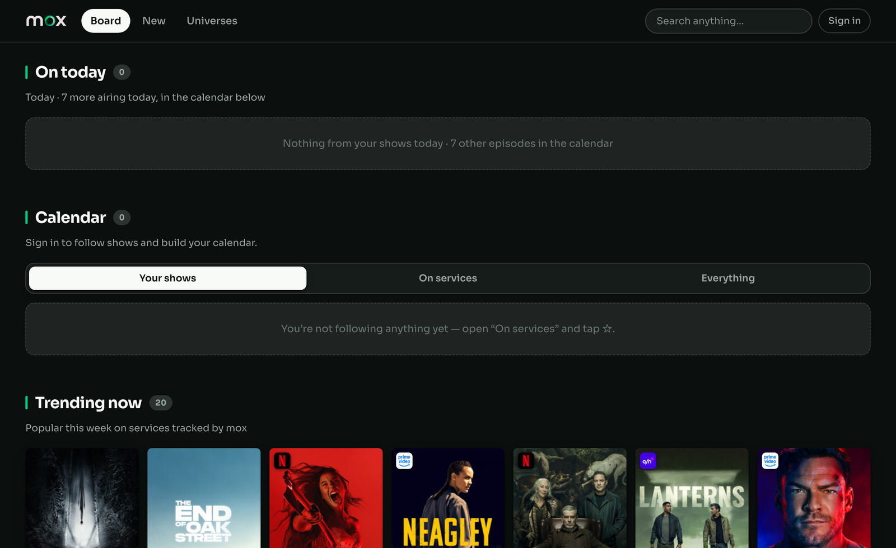
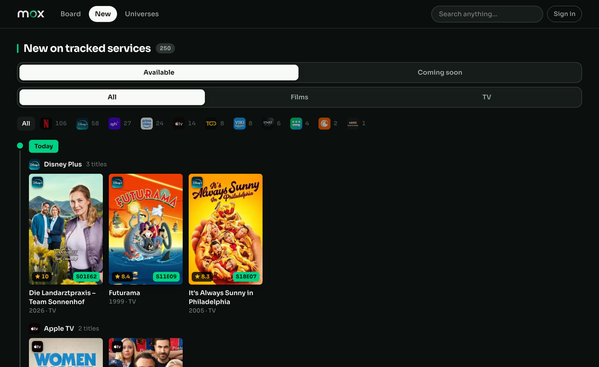
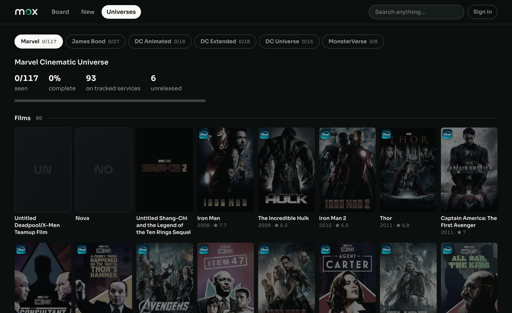
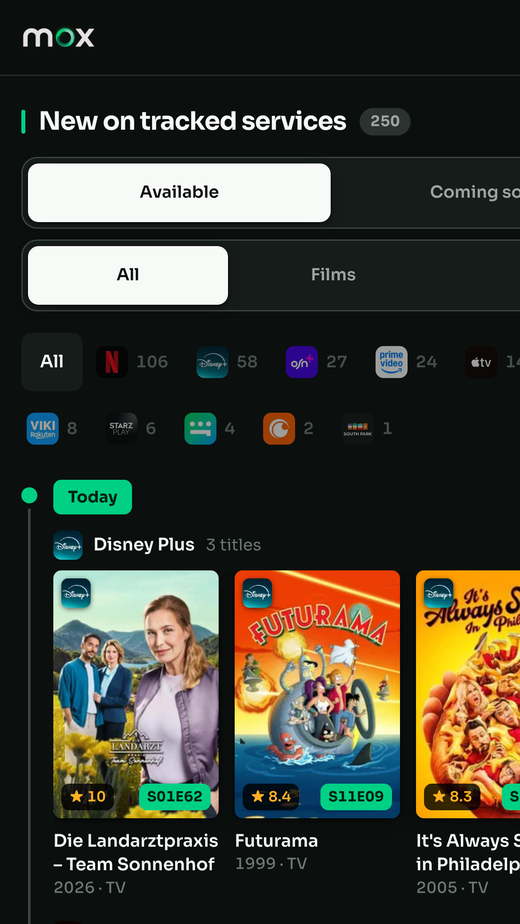

<p align="center">
  
</p>

<p align="center">
  <strong>What's on tonight, and where to watch it.</strong>
</p>

<p align="center">
  <a href="https://github.com/zmosama/mox/actions/workflows/ci.yml"></a>
  
  
</p>

---

**mox** is a personal film and TV board. It answers four questions, in the order
you actually ask them: what is airing today, what just landed on the services I
pay for, what is worth buying, and which of these would I actually like.

It is built for one household in Egypt, which shapes almost every decision in
here — the calendar runs on Cairo time, the service catalogue is TMDB's Egyptian
list, and prices come back in EGP — though the currency is whatever the store
reports, not a constant.

## What it looks like

**The board** — what airs today, your calendar, and what is trending on the
services you actually have.



**New** — a timeline of what reached each service, newest first, grouped by day
and then by service. Filter it to one service, or to films or TV.



**Universes** — franchise progress, rebuilt from TMDB every night, so a film
announced next month appears on its own.



<p align="center">
  
</p>

## The idea

Most "what to watch" tools are catalogues you search. mox is the opposite: it
decides what to put in front of you and gets out of the way.

**It maintains itself.** Nothing in it is a list somebody keeps up to date. Every
feed, every airing, every franchise and every price is rebuilt from TMDB,
TVmaze and JustWatch by a job that runs nightly. There is no admin screen for
adding a film, because adding films is not something a person should be doing.

**It knows what you have.** A title you cannot watch is noise. Pick your
subscriptions once and everything filters to them — the board, the calendar, the
timeline, the franchise pages.

**It has an opinion.** Six verdicts (`love`, `like`, `dislike`, `watchlist`,
`seen`, `hidden`) feed a taste model that ranks everything else. Rating
something removes it from the queue, which is the point: the board is a queue,
not a library.

## How it stays current

`npm run refresh` is the whole of it. The deploy schedules it nightly and it is
safe to run by hand at any time.

| step | what it rebuilds |
| --- | --- |
| **services** | the streaming-service catalogue people pick from, in TMDB's own priority order |
| **feeds** | `/new` — what reached a tracked service in the last 60 days, what is due in the next 90, what is trending this week |
| **calendar** | upcoming episodes for every series the site knows, 60 days ahead, timed to when they actually arrive here |
| **universes** | franchise membership, from each universe's TMDB keyword, company or collection |
| **store** | what has appeared on the digital shelves since the last sweep |
| **prices** | what those arrivals cost to rent or buy |
| **cache** | drops stale TMDB responses, last so nothing else loses a warm cache |

Every one of these was once a fixed list, written by a one-off import and never
touched again. `/new` froze on the day of the import; the calendar held five
weeks of airings and would then have emptied and stayed empty; the MCU ended at
whatever had been released that week.

### Three rules the job keeps

**A step that fails does not stop the others.** A calendar TMDB could not answer
for is no reason to leave the release timeline stale as well. The run reports
each step and exits non-zero if any failed, so a bad night is visible in
`data/refresh.err.log` rather than silent.

**An empty answer is never believed.** No feed, franchise or catalogue is ever
replaced with nothing. A bad night shows yesterday's site, never a blank one.

**It does not rename what is already named.** TMDB answers in en-US, so an early
version relabelled `البرنس` to "The Prince" and "The Office (US)" to "The Office"
overnight — a library curated over years, renamed by a job meant to keep scores
fresh. Scores, posters and dates are refreshed; names are left alone, and only
new titles take TMDB's.

It writes nothing to `features`. That table is the taste model's input, and
changing it changes what the board recommends — its own decision, not a side
effect of keeping a timeline current.

## The parts worth explaining

### When an episode actually arrives

TMDB publishes an air date and no air time, and that date belongs to the
network, not to you. HBO's Sunday 9pm ET is 4am Monday in Cairo. Stored raw,
every HBO episode sat on the page a day early and dropped out of "today" on the
morning it first became watchable.

TVmaze publishes a real instant per episode, which needs no guessing at all.
Measured against 188 upcoming episodes it agreed with a hand-kept network list
167 times, and *every* disagreement was the list being wrong — Citytv, CBC, BET
and Global TV all broadcast at 20:30 or later and were simply missing from it.
The list survives as the fallback for shows TVmaze does not carry. Matching is
by IMDb or TVDB id and never by name: "The Office" is four shows, and a calendar
that guesses between them is worse than one that admits it cannot tell.

### A shop is not a release feed

A film reaches a digital store three or four months after cinemas. Apple's
Egyptian store held 6,265 films with 168 released inside the year and none
inside the month — a release-dated feed of it renders empty forever while the
shelf behind it changes every week.

So the shelf is recorded and compared. Each sweep is ids only (six thousand full
titles a night to answer a set difference would be absurd) and the few that turn
out to be new are fetched properly afterwards. Prices come from the base64
payload JustWatch puts on every offer link — its own data rather than its
current markup, and far steadier to read than the page.

### The taste model

No AI. Weighted counting with three corrections, because a straight tally of 229
loves against 10 dislikes concludes "you like everything":

1. **Deviation, not volume.** A feature scores by how far it pulls a verdict
   above *your own average*, so a feature rated exactly at that average
   contributes nothing.
2. **Rarity.** "action" sits on most of the catalogue and says almost nothing;
   "time loop" sits on a handful. An idf term lets the specific outweigh the
   broad.
3. **Confidence.** Rarity makes a feature loud, so two ratings must not shout —
   `n/(n+2)` damps thin evidence.

Plus a sparse prior, so a title we know almost nothing about scores near zero
rather than near the top. Reality shows carry no keywords, no recurring cast and
no collection, and once outranked every drama.

`src/lib/taste.test.ts` checks the TypeScript against the original Python
implementation's own output, title for title and score for score.

### Cairo, not UTC

`todayISO()` formats in `Africa/Cairo` and everything dates through it. Using
`toISOString()` meant that between midnight and 2am local, a film released today
still rendered as unreleased.

## The stack

- **Next.js 16** (App Router, React 19) — every page is server-rendered on demand
- **SQLite** through **Drizzle ORM**, in WAL mode, one file
- **Tailwind CSS 4**, with every colour, radius and shadow as a token in
  `globals.css`
- **Vitest** — no network, no fixture of the real database, nothing that
  needs a server running
- **TMDB** for titles, **TVmaze** for air times, **JustWatch** for prices

No hosted database, no queue, no container. It runs as one Node process next to
one file.

## Layout

```
src/
  app/            pages and route handlers; icons live here too
  components/     the UI, one concern per file
  db/             schema.ts is the single definition of every table
  lib/            everything with a decision in it — and everything tested
    taste.ts        the ranking model
    feeds.ts        which titles belong in which feed
    airing.ts       when an episode actually reaches a viewer here
    providers.ts    which of your services a title is included on
    queries.ts      every read the pages do, in one place
scripts/
  refresh.mts     the nightly job
  refresh/        one module per step
  brand-assets.py cuts every icon out of the identity board
brand/            the identity board, and what is cut from it
drizzle/          migrations, applied with `npm run db:migrate`
deploy/           deploy script and LaunchAgent templates
```

Two rules hold this together. **Pages never assemble SQL** — they call
`src/lib/queries.ts`, so the shape a component receives is declared once.
**Anything with a decision in it lives in `src/lib` and has a test**, which is
why the feed windows, the air-time rules and the provider matching can all be
checked without a network or a database.

## Running it

Node 24 or newer (npm 11 writes the lockfile) and SQLite.

```bash
npm ci
npm run db:migrate
npm run dev
```

Open <http://localhost:3000>. Every page works signed out. Sign in at
`/admin/login` to rate titles, follow shows and choose your subscriptions.

For a brand-new database, create the first account and then:

```bash
npx tsx scripts/ensure-owner.mts
```

That account becomes the install owner — the only one who can change roles or
delete accounts, and the only one who cannot be demoted.

Then fill it with something:

```bash
npm run refresh
```

### Environment

`.env.local` in the project root, ignored by Git:

```dotenv
TMDB_API_KEY=your_tmdb_key
TMDB_REGION=EG
MOX_DB=./data/mox.db
MOX_TMDB_CACHE=./data/tmdb-cache
```

Optional:

- `MOX_SECURE_COOKIES=true` forces session cookies to HTTPS-only. Normally mox
  detects HTTPS from the request or `X-Forwarded-Proto`; leave it off if you
  reach the server directly over plain HTTP.
- `MOX_OWNER` names the owner account for `scripts/check-owner.mts` and the
  legacy importer.

Deploy settings live in `deploy/target.env`, not here.

## Data

- Migrations are in `drizzle/`, applied with `npm run db:migrate`. They only ever
  add.
- `data/`, `backup/`, `legacy/`, `.env*` and `deploy/target.env` are ignored:
  they hold accounts, sessions, ratings, API keys and one particular server's
  details.
- SQLite runs in WAL mode. Use `VACUUM INTO` for a consistent live backup —
  copying `mox.db` alone silently omits recent writes sitting in `mox.db-wal`.
- Never copy a local database over a running install. The server owns its own.

Passwords are scrypt with a per-user salt. Changing any password revokes every
session that account had, including the owner's own.

## Quality

```bash
npm run check     # lint, typecheck, tests
npm run build
```

CI runs `npm run check` on every push. `npm run build:webpack` is a diagnostic
fallback if Turbopack itself fails.

The core tests are self-contained. When a private local dataset is present, an
extra differential suite verifies the TypeScript taste ranking against the
historical Python output — it skips cleanly when that data is absent, which is
why CI is green without it.

## Deploying

`deploy/deploy.sh` pushes this repository to a Mac reachable over SSH and runs it
there under two LaunchAgents: one serving the app, one refreshing its data
nightly.

Configure the target once — the file is ignored by Git, so your server details
stay yours:

```bash
cp deploy/target.env.example deploy/target.env
```

Then, from the repository root:

```bash
./deploy/deploy.sh
```

It backs the server's database up first and **refuses to continue if that backup
failed**; syncs code while excluding every database, backup, build output and
`.env.local`; installs, migrates and builds on the server; then renders
`deploy/launchd/*.template` into LaunchAgents and reloads both. Because the
refresh agent is `RunAtLoad`, a deploy also brings the data current rather than
waiting for the next night.

The server needs its own `.env.local` with a TMDB key. The deploy deliberately
never copies yours.

## The identity


The full board is committed at `brand/identity.webp`, and
`scripts/brand-assets.py` cuts every icon the app serves out of it — the tile at
16 through 512, the maskable variant, the home-screen icon and the wordmark.

<br clear="left">

| | |
| --- | --- |
| Page | `#0B0F0E` |
| Card | `#1F2422` |
| Green | `#00D084` |
| Mint | `#A7F3D0` |
| Ink | `#F8FAF8` |
| Type | Sora, with IBM Plex Sans Arabic for Arabic |

The mark is measured off the board rather than redrawn: an earlier pass drew it
as SVG geometry and got the ring's counter wrong by a third. It is not a flat
donut but a lit ribbon — mint where the light lands, deeper green opposite, its
end tucking behind itself at the lower left. The wordmark is extracted as
premultiplied alpha, which is what keeps the glow around the `o` intact where a
threshold cut-out would leave a hard edge.

Run the script after any change to the board; never redraw by hand.

```bash
python3 scripts/brand-assets.py
```

## Licence

No licence is granted: the code is public to read, not to reuse. The identity —
the board, the mark and everything cut from it — is not for reuse at all.
